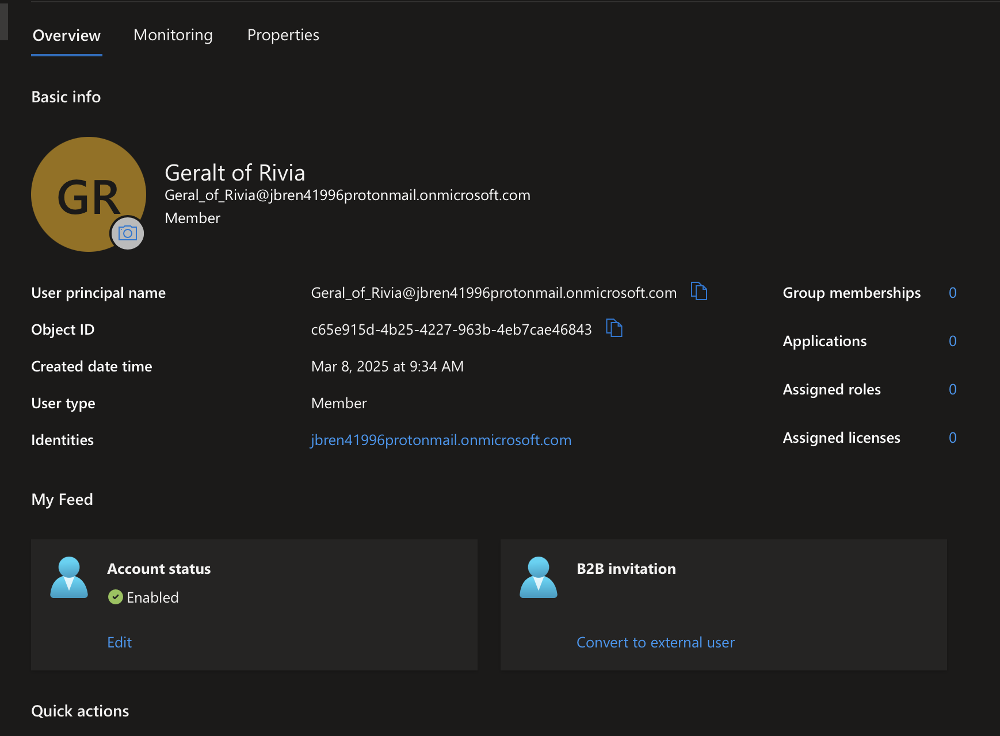
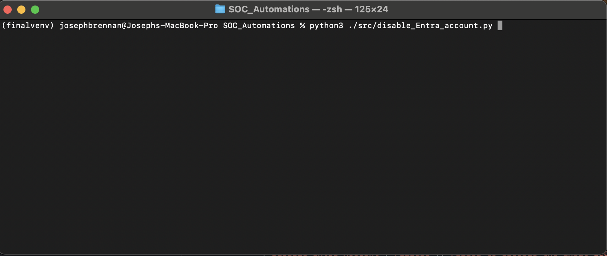
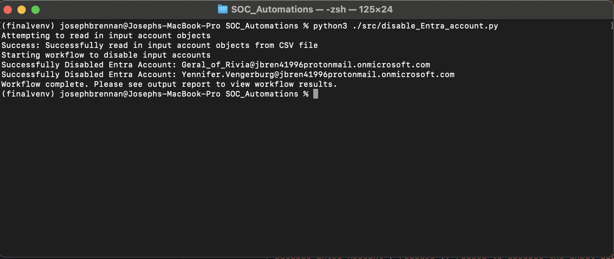
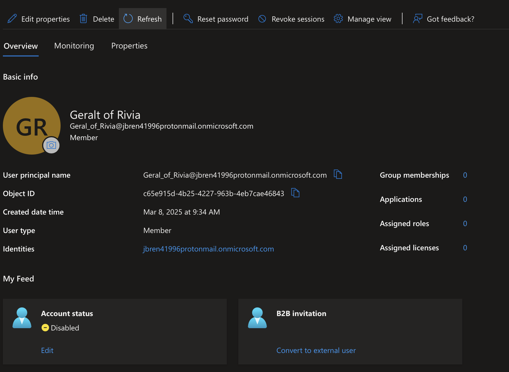

# Automated Remediation Workflows for Detection Engineering & Incident Response

This repository contains tested, fully functional, and production ready Python scripts which can be utilized in Detection Engineering pipelines, SOAR workflows, and case management ticket enrichment. 

## Overview

The Python scripts leverage Microsoft Graph API, SNOW Table API, and Microsoft Defender for Endpoint API to auto-remediate threats and significantly increase SOC efficiency

Several workflows including disable_Entra_account.py increase SOC efficiency by > 80%

Each script includes:
- **Robust error handling at the input level and API level**
- **JSON, ndJSON, JSONL, and CSV input options**
- **Modular structure allowing customization of SOAR workflows and Detection Engineering pipelines**      

## Available Workflows

| Script            | Description                                                        |
|------------------------------|--------------------------------------------------------------------|
| disable_Entra_account.py      | Disables an account within EntraID     |
| revoke_MFA_Methods.py       |   Revokes all MFA methods enrolled by an Entra ID account     |
| revoke_active_sessions.py   | Revokes all active tokens issued by Entra ID to an account            |
| remove_object_from_entra_security_group.py    | Removes Entra ID account from Entra ID security group                 |
| enrich_incident_with_account_details.py      | Locates an account within Entra ID and writes a JSON file indicating account details like geolocation, department, job title, etc   |
| locate_account_within_Entra_ID_Directory.py | Validates an input account identifier represents a valid Entra ID account | 
|retrieve_sign_in_logs_from_Entra_ID.py | Retrieves the past 7 days of Entra ID interactive Sign-In logs for a target account |
| trigger_MDE_Scan.py | Triggers an MDE AV Scan of a target system

## Demo Screenshots
**Before**: Target account still enabled

**Script Execution**:

**After**: Account successfully disabled 

## Requirements
- pip install -r requirements.txt
- Entra ID App registration with API permissions: 
    - AuditLog.Read.All
    - GroupMember.ReadWrite.All
    - OrgContact.Read.All
    - User.EnableDisableAccount.All
    - User.Read
    - User.Read.All
    - User.RevokeSessions.All
    - UserAuthenticationMethods.Read.All
    - UserAuthenticationMethods.ReadWrite.All
    - Machine.Scan
- Secret Management
    - Store secrets in a local .env file as: 
    - Graph_API_Client_Id=
    - Graph_API_Client_Secret=
    - SNOW_API_Client_Id=
    - SNOW_API_Client_Secret=

## Input Formats
- The workflows support the following input formats
    - CSV
    - JSON
    - ndJSON
    - JSONL
- Example input files are located within ./input_files
    - remove_object_from_entra_security_group.py -> account_and_group.csv 
    - Performing actions/retrieving info for Entra ID account -> accounts.csv, accounts.json
    - Trigger MDE AV Scan -> hosts.csv, hosts.json

## Executing the Workflows
- Simply use a Python interpreter to invoke the desired script
    - python3 ./disable_Entra_account.py
 
 
 
    

